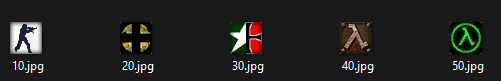

# VFD-Display-Project
A repository with all the necessary schematics, codes and scripts to build a screen that show your Steam activity, like what game you are currently playing. While IDLE, the screen display current forecast thanks to OpenWeatherMap and current time via NTP


## Features
* Steam activity with the corresponding game icon
* Current game session duration
* NTP Clock
* Current day weather forecast
* Random images gallery
## Parts list

I used the following parts for this project :

[VFD Screen](https://fr.aliexpress.com/item/1005004465771709.html)

[NodeMCU - ESP8266](https://www.amazon.fr/gp/product/B07V4KL8CW?ie=UTF8&th=1)
## Wiring

Note : +5V out needs to be wired once everything works as intended. If you power the screen through the USB-C plug, +5V out can power the esp8266 via the Vin pin.


## APIs
### Steam

For the screen to work, you will need a Steam API key that you can generate through the Steam website :

https://steamcommunity.com/dev/apikey

You can provide any domain name, it will generate your key anyway. Keep it secret!

### OpenWeatherMap

To get the current weather, just create an account on the OpenWeatherMap website. Access your API tokens on the following link :

https://home.openweathermap.org/api_keys

Those keys can take about 2 hours until they are considered valid, the screen may not work immediately if you just started building this project.
## Programs
### Python
Those codes are usefull for converting images in a suitable format for the esp8266.

### 1_icons_downloader.py

This programm download every single icon of your Steam library (it doesn't work with games shared through Steam Family though).
To use it, provide the api key and your steamId in the following lines :
```python
STEAM_API_KEY = ""
STEAM_ID = ""
```
Then, every icon will be located in a "icons" directory with the appId as the filename once you run the programm :



Each icon being 32x32 pixels.

### 2_icons_to_bitmap.py

To see how the images will look on the screen, this programm will resize icons to a 48x48 size in a monochromatic bitmap format.

By default, it takes images from the "icons" directory and output them in "images_bitmap" folder.
```python
input_folder = "icons"  # Change this name according to your source folder
output_folder = "images_bitmap"  # Converted images will be saved here
```
Also, you can adjust the threshold for the black and white conversion.
```python
threshold = 128 # Contrast threshold for black to white conversion
```
Personnaly, I used Paint to adjust the results to my liking.

### 3_bitmap_to_raw.py

Then, images are converted to raw binary for the esp8266. 

By default, it will take the input images from the "images_bitmap" directory and create the output images in the "images_raw" folder.

Those resulting images are the ones that need to be accessible via an URL. You can fork this repository and add your own images and just change the URL as seen below.

Also, for 
```python
# Directories for source and converted images
input_folder = "images_bitmap"  # Folder containing input images
output_folder = "images_raw"  # Folder for converted RAW files
```
### ESP-8266

The main file is VFD-Display-Project.ino :

Configure your Wi-Fi credentials here :
```c++
// Wi-Fi Configuration
const char * ssid = "XXXXXXXX";
const char * password = "XXXXXXXX";
```

And the Steam API - steamId of your account here :

```c++
// Steam API Configuration
const char * STEAM_API_KEY = "XXXXXXXX";
const char * STEAM_ID = "XXXXXXXX";
```
Configure your OpenWeatherMap API key here :

```c++
//OpenWeatherMap configuration
const char * OPENWEATHERMAP_KEY = "XXXXXXXX";
```

And your API request to fit your location and language here (Check the [OpenWeatherMap API documentation](https://openweathermap.org/current) for all available options) :
```c++
//API URL for OpenWeatherMap, adjust to fit your location and language
String url = "https://api.openweathermap.org/data/2.5/weather?q=Paris&lang=fr&units=metric&appid=";
```

Finally, add or modify the following URL to match your repository/website. It's the root URL for the the raw images.

If you forked this repository you can edit the following link with your Github username instead.

```c++
// Base URL for images; it will be dynamically generated based on the game ID
String imageUrlBase = "https://raw.githubusercontent.com/Pi1lot/test-esp8266/main/";
```
You can also adjust the NTP clock for the correct timezone :
```c+
// Adjust UTC offset here (in seconds)
timeClient.setTimeOffset(3600); // Adjust for the timezone (e.g., 3600 for UTC+1)
```
## Notes
Regarding names for icons binary files, 0.raw is used when no icons are available for a game, A.raw to Z.raw are used for the random image gallery.
## Sources and usefull links
[VFD Display datasheet](https://cdn.hackaday.io/files/1916648200152576/EPC-INBN0BV1294UD_SPEC.pdf)

[Car VFD Gauges with Arduino UNO - Upir](https://www.youtube.com/watch?v=Frq_JP1lalE0)

[U8g2 library Wiki](https://github.com/olikraus/u8g2/wiki/)

[U8g8 library Wiki](https://github.com/olikraus/u8g2/wiki/u8x8reference)

[Steam API documentation](https://developer.valvesoftware.com/wiki/Steam_Web_API)

[OpenWeatherMap API Documentation](https://openweathermap.org/current)

[ESP8266 NodeMCU HTTPS Requests](https://randomnerdtutorials.com/esp8266-nodemcu-https-requests/)
